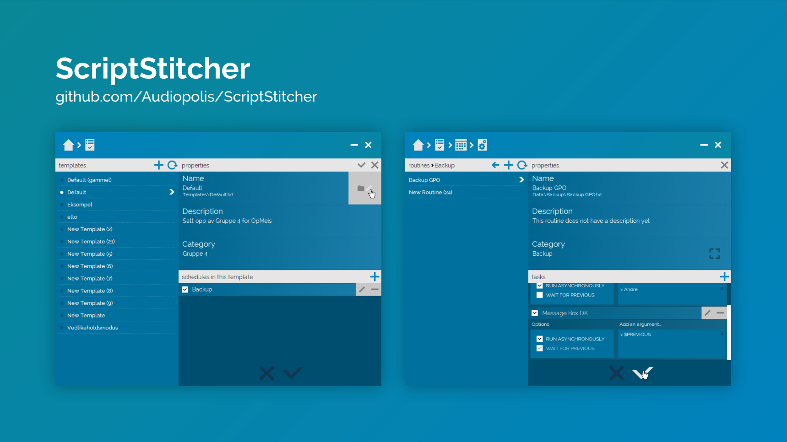

# ScriptStitcher

This is a tool that allows you to create arbitrarily complex sequences of pre-defined or custom tasks without requiring any scripting experience. (The program currently only accepts PowerShell scripts.) I wrote this as an addition to the systems of a fictitious organization whose data systems I and a group of other students developed for a project at the Norwegian University of Science and Technology.

ScriptStitcher allows you to schedule and categorize these sequences, and switch between any number of user-defined templates. It also shamelessly incorporates a highly dynamic user interface with drag-and-drop functionality, as well as backup, error detection, multi-threaded script execution, custom user controls, etc.